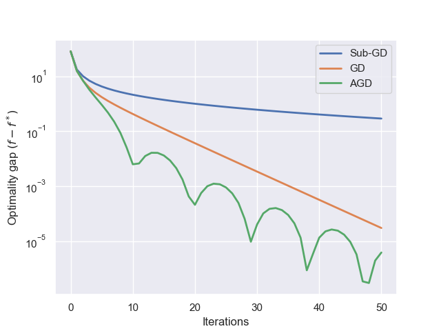

## MLOPT course - 096336 @ Technion IE&M faculty 

This repo contains the assignments of the course and their solution. The programming part is implemented in Python.
The assignments cover the following topics:
- Assignment 1:
  - First-order deterministic convex optimization methods. Programming part: subgradient descent (sub-GD), gradient descent (GD), and accelerated gradient descent (AGD) for linear regression.
  

  

