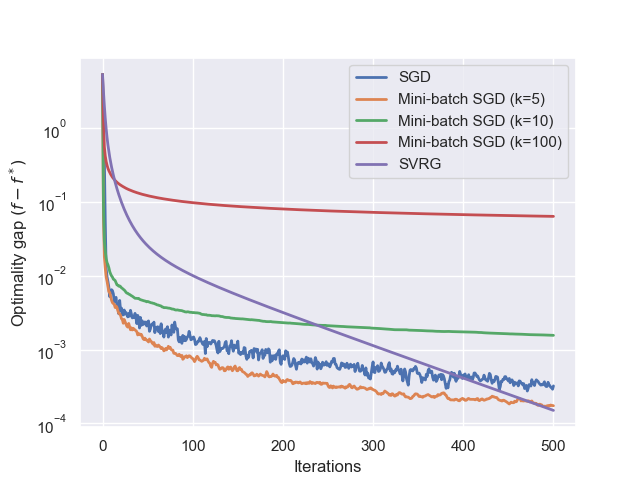
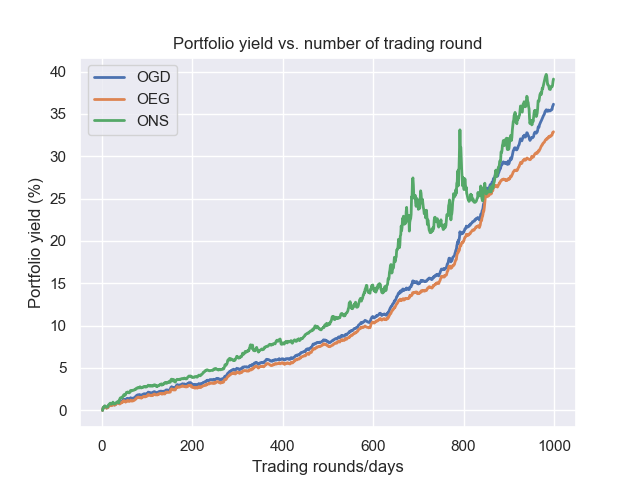

## MLOPT course - 096336 @ Technion IE&M faculty 

This repo contains the assignments of the course and their solution. The programming part is implemented in Python.
The assignments cover the following topics:
- Assignment 1:
  - First-order deterministic convex optimization methods. Programming part: subgradient descent (sub-GD), gradient descent (GD), and accelerated gradient descent (AGD) for linear regression.
  

  

- Assignment 2:
  - Frank-Wolfe (conditional gradient method), first-order stochastic convex optimization methods. Programming part: stochastic gradient descent (SGD) + mini-batch version and stochastic variance-reduced gradient (SVRG) method for linear regression (as in Assigment 1).
  

  

- Assignment 3:
  - Online learning algorithms: Follow-the-Leader (FTL), Online Gradient Descent (OGD), FKM. Programming part: OGD, Online Exponentiated Gradient (OEG) and Online Newton Step (ONS) applied to the online rebalancing portfolio selection (ORPS) problem with stocks data.
    

  

